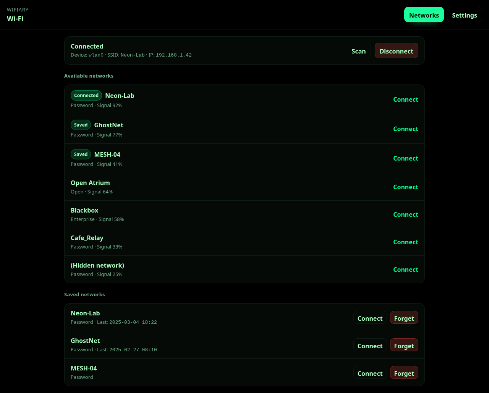
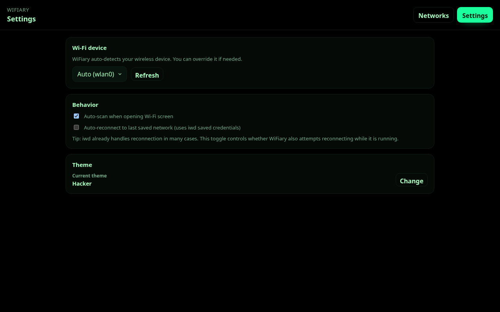

# WiFiary

A polished, non-technical Wi‑Fi connection GUI for **Arch Linux** using **iwd** (`iwctl`), built with **Tauri v2** (Rust backend) + **Vite + React + TypeScript**.

## Features

- Scan and list available Wi‑Fi networks
- One-click connect (password prompt when needed)
- Disconnect / forget networks
- View saved networks
- Device auto-detection with manual override
- Theme system using CSS variables (Catppuccin-like) + custom theme JSON
- XDG config storage in `XDG_CONFIG_HOME/wifiary/` (fallback `~/.config/wifiary/`)

## Requirements (Arch Linux)

- `iwd` installed and enabled
  - `sudo pacman -S iwd`
  - `sudo systemctl enable --now iwd.service`
- A PolicyKit authentication agent (usually already present in desktop environments)
  - Examples: `polkit-gnome`, `lxqt-policykit`, `mate-polkit`, etc.
- `pnpm` (recommended) + Rust toolchain

## Development

```bash
pnpm install
pnpm tauri:dev
```

## Screenshots

Generate screenshots with Playwright (first run may download the Chromium browser). The script uses mock data and the Hacker theme:

```bash
pnpm install
pnpm exec playwright install chromium
pnpm build
pnpm screenshots
```

Images are written to `assets/screenshots/` and embedded below.
Preview the UI with mock data via `http://localhost:4173/?mock=1` when running `pnpm preview`.




## Build / install (run from a command)

Build a release binary (no packaging/bundling required):

```bash
pnpm tauri:build
```

Install it into your user PATH:

```bash
install -Dm755 src-tauri/target/release/wifiary ~/.local/bin/wifiary
```

Install a desktop entry + icon (so it shows in app launchers/docks):

```bash
bash scripts/desktop-install.sh
```

Then install the privileged helper + PolicyKit policy (required for Wi‑Fi management):

```bash
pnpm polkit:install:release
```

Optionally allow passwordless usage for `wheel` users:

```bash
pnpm polkit:install:passwordless-wheel
```

## Packaging installers (optional)

If you want `.deb`/`.rpm`/`.AppImage` bundles (not needed to run `wifiary` locally):

```bash
pnpm tauri:bundle
```

Note: AppImage bundling requires `linuxdeploy` to be available in `PATH`.

Notes:

- The app uses a privileged helper (`wifiary-helper`) via `pkexec` for iwd operations.
- Without PolicyKit setup, connect/disconnect/forget will fail (or prompt unexpectedly).

## PolicyKit setup (required for Wi‑Fi management)

WiFiary uses a dedicated PolicyKit action (`org.wifiary.helper.run`) to run a constrained helper binary as root.

Do you *need* PolicyKit?

- If your user is already permitted to run `iwctl` actions (some setups allow this via D‑Bus permissions/groups), WiFiary could theoretically run unprivileged.
- For a robust GUI that works for non-technical users and can safely trigger privileged iwd operations, **PolicyKit is the recommended approach**. It provides a standard authentication prompt and avoids running the whole app as root.

### Install helper + policy files

For a system install, place files as:

- Helper binary: `/usr/lib/wifiary/wifiary-helper`
- Policy: `/usr/share/polkit-1/actions/org.wifiary.helper.policy`
- Optional rule (passwordless for wheel): `/etc/polkit-1/rules.d/10-wifiary.rules`

Example:

```bash
sudo install -Dm755 src-tauri/target/release/wifiary-helper /usr/lib/wifiary/wifiary-helper
sudo install -Dm644 packaging/polkit/org.wifiary.helper.policy /usr/share/polkit-1/actions/org.wifiary.helper.policy
sudo install -Dm644 packaging/polkit/10-wifiary.rules /etc/polkit-1/rules.d/10-wifiary.rules
```

If you do not want passwordless behavior, **do not install** `10-wifiary.rules`. The default policy requires admin authentication.

### Dev note (running `pnpm tauri:dev`)

`tauri dev` builds and runs the main `wifiary` binary, but the helper (`wifiary-helper`) must also exist for scan/connect to work.

Recommended dev setup (matches the production policy path):

```bash
pnpm polkit:install
```

Optionally (passwordless for `wheel`):

```bash
pnpm polkit:install:passwordless-wheel
```

## Config storage

WiFiary stores `config.json` under:

- `XDG_CONFIG_HOME/wifiary/config.json`
- or `~/.config/wifiary/config.json` if `XDG_CONFIG_HOME` is not set.

## Security notes

- The frontend never executes privileged operations.
- The backend calls a helper through `pkexec`, and the helper enforces a strict allowlist and argument validation.

See `DESIGN_NOTES.md` for details.
